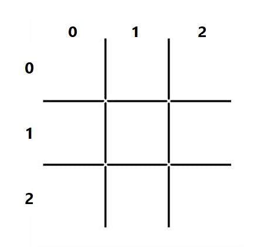

#Tic Tac Toe: AI Final Project

First you need to clone the project:
```bash
git clone https://github.com/samMofidian/Tic-Tac-Toe-using-AI.git
```
To run this Python scripts open a command line and type the word python followed by the path to your script file like this: 
```bash
python main.py
```
At first, you have to choose playing algorithm:
- Alpha-Beta
- Minimax

Then when you start the game you can choose the game mode between 4 options:
- Human Vs AI(Human is the game starter)
- AI Vs Human(AI is the game starter)
- Human Vs Human
- AI Vs AI

If AI and Human are versus each other, you have to choose AI level:
- Hard
- Easy


*X is the game starter and changing the game starter to O need some changes in the code.*



###Evaluation Function:
It has 3 possible values:
- -1 if player that seeks minimum wins
- 0 if it's a draw
- 1 if player that seeks maximum wins

This evaluation function is  common for all games in which it's possible to search the whole tree, all the way down to leave.

<mark>**Winning against this kind of AI is impossible. If we assume that both player and AI are playing optimally, the game will always be a tie. Since the AI always plays optimally, if we slip up, we'll lose.**</mark>

###MiniMax Vs Alpha-Beta:
| Algorithm | Min Time | Max Time |
| ------------- | ------------- | ------------- |
| Minimax  | 4.57s  | 5.34s  |
| Alpha-Beta  | 0.16s  | 0.2s  |

So alpha-beta pruning makes a major difference in evaluating large and complex game trees.
